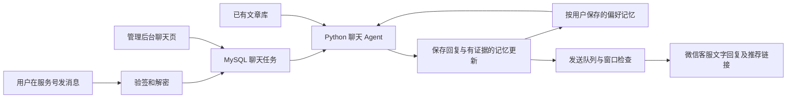

# 微信服务号与知识助手聊天

普通用户入口：`https://你的域名/wechat/chat`。公众号菜单只需配置该地址；页面会自动跳转 `GET /api/wechat/auth`，后端使用 `snsapi_base` 完成授权并签发 HttpOnly 会话 Cookie。管理员入口仍是后台的 **与知识助手聊天**，两者路由和身份严格分离。公众号服务号使用同一套聊天、偏好记忆和推荐后端。

本地无 OAuth 配置时可在开发环境设置 `WECHAT_DEV_ANONYMOUS=true`，每次授权入口生成随机匿名用户；生产校验会拒绝该开关，禁止固定用户 ID。网页 API 为 `GET /api/wechat/auth`、`GET /api/wechat/callback`、`GET /api/wechat/me`、`GET /api/wechat/conversations`、`POST /api/wechat/messages`、`GET /api/wechat/memories`、`DELETE /api/wechat/memories/{key}`（也兼容 `?key=...`）、`GET /api/wechat/recommendations`。这些 API 从签名 Cookie 取得用户身份，客户端不能提交 `user_id`。

## 已实现的交互

- 网页聊天、异步回复、历史记录、推荐文章链接、推荐理由、切换管理会话。
- 从用户当条消息提取兴趣、学习目标、不喜欢的内容、内容风格、知识水平。记忆带原文证据，可以逐条或全部删除。
- 微信文本消息回调采用安全模式：验签、AES 解密、AppID 核验、入库后快速 ACK，异步调用 Agent，并通过客服消息接口回复。
- 用户与消息隔离、回调去重、持久化任务和发送状态；回复包含实际内容库的文章链接。



推荐从已有文章库最近最多 60 篇中排序，最多返回 3 篇；不自动为每次聊天抓取网络内容。聊天排序使用偏好、关键词、来源、质量、时效与多样性，当前不调用向量/图谱检索。没有足够匹配内容时明确说明。后台原有文章流水线也会读取其配置用户的聊天偏好；它仍是单个配置用户的任务，不会自动为每位微信用户运行定时抓取。

## 记忆控制

微信自动记忆默认关闭：

| 输入 | 行为 |
| --- | --- |
| 开启记忆 | 后续明确表达的学习和内容偏好可以保存 |
| 关闭记忆 | 停止自动记忆，保留已有记忆 |
| 记住兴趣：Go, 数据库 | 本条明确授权保存兴趣，演练模式也能验证 |
| 记住目标：准备后端面试 | 明确保存目标，另支持“避开”“风格”“水平” |
| 你目前记得我哪些偏好？ | 询问已保存偏好 |
| 根据我的兴趣推荐内容 | 对文章库进行个性化推荐 |
| 忘记全部记忆 | 清除聊天偏好，排除此前对话作为模型上下文 |

网页通过“允许从本条消息记住学习与内容偏好”控制当条授权。关闭该选项仍会保存聊天历史；重试网络中断的同一条提交会保持原始授权设置，避免同一请求改变含义。正文包含“不要记住”“别记住”“不要保存”也会禁止当条记忆更新。

配置 `MEMORY_PROVIDER_URL` 和 `MEMORY_ROLE_SECRET` 后，Mem_Pro 适配服务是长期记忆的真相源；Go 后端只保存聊天任务和审计索引。服务不可用时，聊天仍可使用本地历史上下文，但记忆列表会明确返回“记忆暂时不可用”，不会伪装成删除成功。删除请求先调用内部服务，再清理 KnowMate 索引；删除失败会返回错误。当前项目内适配服务的健康响应会明确报告 MongoDB、Neo4j、Milvus 尚未配置，因此不能把本地适配测试当作完整三库删除验收。

真实模型的自然语言提取需上线前人工抽样验证。服务端会校验类别、长度、当条原文证据及授权，但不能仅靠这些校验证明模型对引用和否定表达的理解正确。

## 服务号配置

本机使用 `scripts/local_server.py` 生成的配置。编辑对应环境的 `.local-server/production/wechat.env`（演练则为 `rehearsal`）：

```dotenv
WECHAT_ENABLED=true
WECHAT_APP_ID=
WECHAT_APP_SECRET=
WECHAT_TOKEN=
WECHAT_ENCODING_AES_KEY=
```

填写有对应接口权限的服务号 AppID/AppSecret、自定义至少 16 位 Token、公众号平台生成的 43 位 EncodingAESKey。使用**安全模式**，不接收明文 POST。生产 Compose 会把 `WECHAT_*_FILE` 路径透传给 GoFrame；将对应文件挂载到容器内（示例使用 `/run/secrets/`），禁止提交凭据。`WECHAT_ENABLED=false` 时回调返回 404，聊天网页仍可用。

1. 先按照 [本机手册](LOCAL_SERVER.md) 配置真实聊天和 embedding API。公众号还需要自己的独立凭据，单填模型 API 无法启用微信。
2. 准备具有可信证书的公网 HTTPS 地址，仅转发 `GET/POST /wechat/callback` 到本机网关对应路径；公众平台不能访问 `localhost`。公网反向代理或隧道需要能够连接这台 Windows 主机，且主机、Docker 和网络持续在线。当前没有创建公网域名或隧道。
3. 公众平台填写回调 URL、相同 Token 和 EncodingAESKey，选择安全模式。将调用微信接口的实际出口公网 IP 加入平台要求的白名单；隧道域名并不替代出口 IP。具体权限以该账号平台显示为准。
4. 执行 `python -B scripts/local_server.py start --stage production`，使配置生效并启动服务。配置不完整时后端拒绝启动。公众号配置验证和端到端实测必须使用真实账号完成。
5. 微信发送“开启记忆”“记住兴趣：Go, 数据库”“根据我的兴趣推荐内容”，核对回复、记忆来源和推荐链接；随后“忘记全部记忆”，再次查询验证删除。

接入时不要将管理页、数据库、监控端口公开为无认证入口。当前本机 TLS 证书只适用于本机访问，公网需要匹配域名的证书。通用 `docker-compose.prod.yml` 并未单独配置微信公网入口；这里验证的是本机生成的 Compose 和网关配置。

## 身份、发送和运行边界

- 微信身份由 AppID + OpenID 派生，在各用户间隔离。网页“我的会话”是 `default-user`，不会自动和某位微信用户合并。管理员可选择 `wx_…` 会话查看记忆和历史；此页面使用管理员权限，不是向普通用户开放的登录入口。
- 按用户主动文本消息的客服窗口处理：本实现限制 48 小时、最多 5 条，通常每次输入只回 1 条；微信实际接口权限和返回结果优先。不提供任意时间不限量推送，也未实现每天主动推荐。模板/订阅消息需要单独评估账号权限与具体业务场景。
- 重复回调不重复生成回复、不补充额度。取关停止已有窗口发送。单条回复最多 1950 UTF-8 字节，较长结果会截断。
- `ready` 等待发送、`sending` 发送中、`sent` 微信接口确认接受、`expired` 窗口关闭、`rejected` 微信明确拒绝、`uncertain` 网络异常或重启后无法确认送达。`sent` 不代表用户已读。后两种状态不会自动重复发送，需管理员检查权限、网络和实际微信会话；用户可重新提问。
- 仅支持一个后端实例/聊天 worker。数据库队列每用户最多 10 条、全局目标上限 200 条；多用户并发下全局检查不是严格原子配额。任务按入库顺序串行处理。上线规模扩大前需要独立队列、并发模型和更严格配额。
- 本次未向真实微信账号发送任何消息。自动化验收使用伪造测试账号、真实本机 MySQL 和模拟微信 HTTP transport。

官方接口参考：[客服消息](https://developers.weixin.qq.com/doc/service/api/customer/message/api_sendcustommessage)、[稳定 access_token](https://developers.weixin.qq.com/doc/service/api/base/api_getstableaccesstoken)。
