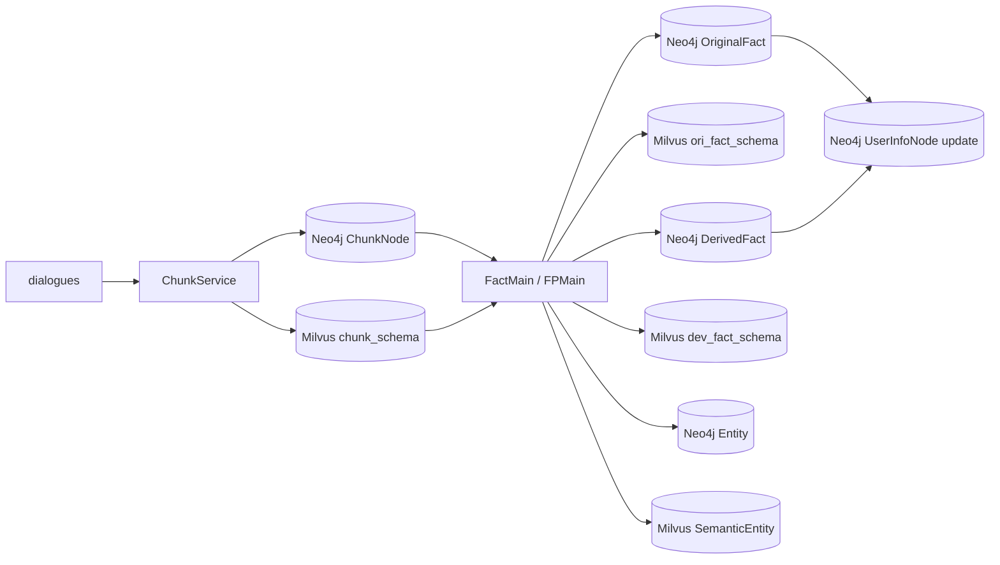

# final_main.py 运行流程图


本文档以 `main/final_main.py` 中的 `BuildMain.main()` 为起点，按当前代码实际调用链回溯 MEM_PRO 的记忆构建流程。本文档不包含 retrieval 相关流程。

## 1. 入口位置

当前脚本入口位于 `main/final_main.py`：

```python
bm = BuildMain()
role_id = "conv-91"
split = 3
file_path = "data/mock_dialogue2.json"
dialogues2 = load_conversations(file_path)
result = asyncio.run(bm.main(role_id, dialogues2, split))
```

真正的业务入口是：

```python
BuildMain.main(role_id, dialogues, split)
```

输入参数：

- `role_id`：用户 ID。
- `dialogues`：对话列表，来自 `data.transform.load_conversations()`。
- `split`：每批送入 LLM 清洗的对话轮数。

## 2. 总流程图

```mermaid
flowchart TD
    A[python main/final_main.py] --> B[load_conversations(file_path)]
    B --> C[asyncio.run(BuildMain.main(role_id, dialogues, split))]

    C --> D[BuildMain.init_]
    D --> D1[chunk_schema]
    D --> D2[UserInfoStore.uniq_user_info]

    C --> E[Step 1: query UserInfoNode by role_id]
    E --> F{UserInfoNode exists?}
    F -- Yes --> H[Skip create_user_info]
    F -- No --> G[UserInfoStore.create_user_info with empty profile fields]
    G --> H

    H --> I[Step 2: ChunkService.create_all_chunks]
    I --> J[Return chunk_uuids]
    J --> K{chunk_uuids empty?}
    K -- Yes --> L[Print warning and return]
    K -- No --> M[Step 3: loop chunk_uuids]

    M --> N[FactMain.main(chunk_uuid)]
    N --> O[Build original fact]
    N --> P[Build derived fact]
    N --> Q[Build entities]
    N --> R{ori_summary or dev_summary?}
    R -- Yes --> S[Update UserInfoNode profile]
    R -- No --> T[Finish this chunk]
    S --> T
    T --> U{More chunks?}
    U -- Yes --> M
    U -- No --> V[BuildMain.main finished]
```

## 3. BuildMain.main 分步说明

### 3.1 初始化阶段

代码位置：`main/final_main.py -> BuildMain.init_()`

```python
async def init_(self):
    chunk_schema()
    await self.user_info_store.uniq_user_info()
```

执行内容：

1. 调用 `chunk_schema()` 获取 Milvus `chunk_schema` collection schema 定义。
2. 调用 `UserInfoStore.uniq_user_info()` 在 Neo4j 中为 `UserInfoNode.role_id` 创建唯一约束。

注意：`chunk_schema()` 本身只返回 schema 对象；实际 collection 创建由其他 Milvus 管理逻辑负责。

### 3.2 UserInfoNode 检查与创建

代码位置：`main/final_main.py -> BuildMain.main()`

```python
get_user_node = await self.user_info_store.query_by_role_id(role_id)
if get_user_node is None:
    info_dict = {
        "basic_info": "",
        "preference": "",
        "skill": ""
    }
    await self.user_info_store.create_user_info(role_id=role_id, info_dict=info_dict)
```

执行内容：

1. 根据 `role_id` 查询 Neo4j 中是否已有 `UserInfoNode`。
2. 如果不存在，则创建一个空画像节点。
3. 空画像包含三个字段：`basic_info`、`preference`、`skill`。

相关 Neo4j 节点：

```text
(:UserInfoNode {
  role_id,
  user_info_uuid,
  basic_info,
  preference,
  skill,
  create_time,
  last_update_time
})
```

## 4. Chunk 构建流程

入口：

```python
chunk_uuids = await self.chunk_service.create_all_chunks(role_id, dialogues, split)
```

### 4.1 Chunk 子流程图

```mermaid
flowchart TD
    A[ChunkService.create_all_chunks] --> B[Initialize chunk_uuids, dialogue_round, history]
    B --> C[Loop dialogues]
    C --> D[Append dialogue to dialogue_round]
    D --> E{len(dialogue_round) == split?}
    E -- No --> C
    E -- Yes --> F[single_round_chunk(role_id, dialogue_round, history)]

    F --> G[ToolService.get_hash_val]
    G --> H[ChunkStore.query_exist_by_hash]
    H --> I{Hash exists?}
    I -- Yes --> J[Skip this dialogue window]
    I -- No --> K[save_llm_server]

    K --> L[washing_server_llm]
    L --> M[LLM returns history and cleaned dialogues]
    M --> N[Collect dialogue, summary, timestamp]
    N --> O[EmbeddingClient.embed_batch dialogue]
    N --> P[EmbeddingClient.embed_batch summary]
    O --> Q[ChunkStore.create_chunk]
    P --> Q
    Q --> R[Create ChunkNode and HAS_CHUNK relation in Neo4j]
    R --> S[chunk_save_in_milvus]
    S --> T[Insert dia_embedding and summary_embedding into Milvus chunk_schema]
    T --> U[Return history and chunk_uuids]

    J --> V[Continue next window]
    U --> V
    V --> W{Remaining dialogues?}
    W -- Yes --> C
    W -- No --> X[Return all chunk_uuids]
```

### 4.2 create_all_chunks

代码位置：`app/memory/chunk_node/chunk_server/chunk_service.py`

职责：

1. 按 `split` 将完整对话列表切成多个窗口。
2. 每个窗口调用 `single_round_chunk()`。
3. 收集每个窗口生成的 `chunk_uuid`。
4. 最后返回所有 Chunk UUID。

### 4.3 single_round_chunk

主要步骤：

1. 计算当前对话窗口的 hash。
2. 查询 Neo4j 中是否已经存在相同 hash 的 Chunk。
3. 如果已存在，跳过，避免重复分析。
4. 如果不存在，调用 LLM 清洗对话。
5. 从 LLM 返回中提取：
   - `history`
   - `dialogues`
   - 每条 dialogue 的 `dialogue`、`summary`、`timestamp`
6. 批量生成 dialogue embedding 和 summary embedding。
7. 为每条清洗后的对话创建 `ChunkNode`。
8. 将向量写入 Milvus `chunk_schema`。

### 4.4 Chunk 写入 Neo4j

调用：

```python
ChunkStore.create_chunk(role_id, dialogue, summary, timestamp, hash_val)
```

创建节点：

```text
(:ChunkNode {
  role_id,
  chunk_uuid,
  create_time,
  valid_time,
  summary,
  contents,
  hash_val
})
```

创建关系：

```text
(:UserInfoNode {role_id})-[:HAS_CHUNK]->(:ChunkNode)
```

### 4.5 Chunk 写入 Milvus

调用：

```python
ChunkService.chunk_save_in_milvus(role_id, chunk_uuid, dia_embedding, summary_embedding)
```

写入 collection：

```text
chunk_schema
```

字段：

```text
role_id
chunk_uuid
fact_uuid
dia_embedding
summary_embedding
```

其中 `fact_uuid` 初始为空字符串，后续 OriginalFact 复用或创建时可能被更新。

## 5. Fact 构建流程

入口：

```python
for chunk_uuid in chunk_uuids:
    await self.fact_main.main(chunk_uuid)
```

`FactMain.main()` 的当前逻辑：

```python
chunk_summary, chunk_embedding = await build_ori_fact.get_chunk_summary_embedding(chunk_uuid)
ori_summary = await build_ori_fact_main(...)
dev_summary = await build_dev_fact_main(...)
await build_entity_main(...)
if ori_summary or dev_summary:
    await profile_update_main(...)
```

### 5.1 Fact 子流程图

```mermaid
flowchart TD
    A[FactMain.main(chunk_uuid)] --> B[BuildOriFact.get_chunk_summary_embedding]
    B --> B1[Read chunk summary from Neo4j]
    B --> B2[Read summary_embedding from Milvus chunk_schema]

    B --> C[FPMain.build_ori_fact_main]
    C --> C1[Search similar OriginalFact in ori_fact_schema]
    C1 --> C2{Matched ori_fact?}
    C2 -- Yes --> C3[Load old OriginalFact summary from Neo4j]
    C2 -- No --> C4[old summary = empty]
    C3 --> C5[LLM extract_ori_fact_summary]
    C4 --> C5
    C5 --> C6{Matched ori_fact?}
    C6 -- Yes --> C7[merge_chunk_to_ori_fact]
    C6 -- No --> C8[create_ori_fact_]
    C7 --> C9{profile_update == 1?}
    C8 --> C9
    C9 -- Yes --> C10[Return chunk_summary as ori_summary]
    C9 -- No --> C11[Return None]

    B --> D[FPMain.build_dev_fact_main]
    D --> D1[LLM detect_dev]
    D1 --> D2{dev_topic exists?}
    D2 -- No --> D3[Return None]
    D2 -- Yes --> D4[Embed dev_topic and search dev_fact_schema]
    D4 --> D5{Matched dev_fact?}
    D5 -- No --> D6[create_dev_fact_milvus]
    D6 --> D3
    D5 -- Yes --> D7[Load old dev summary, status, confidence]
    D7 --> D8{status == stable?}
    D8 -- Yes --> D9[Only update confidence and link chunk]
    D9 --> D3
    D8 -- No --> D10[LLM merge_dev_summary]
    D10 --> D11[merge_chunk_to_dev_fact]
    D11 --> D12{becomes stable?}
    D12 -- Yes --> D13[Return dev_topic]
    D12 -- No --> D3

    B --> E[FPMain.build_entity_main]
    E --> E1[LLM extract_entities_from_summaries]
    E1 --> E2{entity_list exists?}
    E2 -- No --> E3[Skip entity creation]
    E2 -- Yes --> E4[BuildEntity.entity_embed_save]
    E4 --> E5[Create or reuse Entity]
    E5 --> E6[Link ChunkNode to Entity]
    E5 --> E7[Store non-Time entity embedding in SemanticEntity]

    C10 --> F{ori_summary or dev_summary?}
    C11 --> F
    D13 --> F
    D3 --> F
    E3 --> F
    E7 --> F
    F -- Yes --> G[FPMain.profile_update_main]
    F -- No --> H[Finish chunk]
    G --> G1[Read old UserInfoNode profile]
    G1 --> G2[LLM extract_profile_update]
    G2 --> G3{should_update?}
    G3 -- Yes --> G4[UserInfoStore.update_user_info_]
    G3 -- No --> H
    G4 --> H
```

## 6. OriginalFact 分支

入口：

```python
FPMain.build_ori_fact_main(role_id, chunk_uuid, chunk_summary, chunk_embedding)
```

执行步骤：

1. 调用 `BuildOriFact.chunk_match_ori_fact()`，用 Chunk summary embedding 在 Milvus `ori_fact_schema` 中匹配已有 OriginalFact。
2. 如果匹配成功，从 Neo4j 读取已有 OriginalFact 的 `summary`。
3. 如果未匹配成功，则旧 summary 为空。
4. 调用 `FactLLMExtractor.extract_ori_fact_summary()`，让 LLM 生成：
   - `topic`
   - `profile_update`
5. 如果匹配到旧 OriginalFact：
   - 更新 Neo4j 中的 OriginalFact summary 和 confidence。
   - 更新 Milvus 中的 `ori_fact_schema.summary_embedding`。
   - 更新 Milvus `chunk_schema.fact_uuid`。
6. 如果没有匹配到旧 OriginalFact：
   - 获取重要性分数。
   - 创建 Neo4j `OriginalFact`。
   - 写入 Milvus `ori_fact_schema`。
7. 如果 `profile_update == 1`，返回 `chunk_summary` 给后续画像更新流程。

Neo4j 节点：

```text
(:OriginalFact {
  role_id,
  ori_fact_uuid,
  create_time,
  last_update_time,
  last_used_time,
  summary,
  confidence,
  importance,
  used_count,
  history_feedback
})
```

Neo4j 关系：

```text
(:ChunkNode)-[:HAS_FACT]->(:OriginalFact)
```

Milvus collection：

```text
ori_fact_schema
```

## 7. DerivedFact 分支

入口：

```python
FPMain.build_dev_fact_main(role_id, chunk_uuid, chunk_summary)
```

执行步骤：

1. 调用 `BuildDevFact.get_dev_topic_from_chunk()`，用 LLM 判断当前 Chunk 是否存在派生事实。
2. 如果没有派生事实，返回 `None`。
3. 如果存在派生事实，将 `dev_topic` 向量化，并在 Milvus `dev_fact_schema` 中匹配已有 DerivedFact。
4. 如果没有匹配结果：
   - 创建 Neo4j `DerivedFact`。
   - 写入 Milvus `dev_fact_schema`。
   - 返回 `None`。
5. 如果匹配到旧 DerivedFact：
   - 读取旧节点的 `summary`、`confidence`、`status`。
   - `confidence + 1`。
   - 如果旧节点已稳定，只更新 confidence 并连接 Chunk。
   - 如果旧节点未稳定，调用 LLM 合并新旧派生事实，再更新节点和 Milvus 向量。
6. 当更新后达到稳定状态时，返回派生摘要给画像更新流程；否则返回 `None`。

Neo4j 节点：

```text
(:DerivedFact {
  role_id,
  dev_uuid,
  create_time,
  last_update_time,
  summary,
  confidence,
  status,
  weight,
  ddl
})
```

Neo4j 关系：

```text
(:ChunkNode)-[:DERIVED_FROM]->(:DerivedFact)
```

Milvus collection：

```text
dev_fact_schema
```

## 8. Entity 分支

入口：

```python
FPMain.build_entity_main(role_id, chunk_uuid, chunk_summary)
```

执行步骤：

1. 调用 `FactLLMExtractor.extract_entities_from_summaries()` 从 Chunk summary 中抽取实体。
2. 如果没有实体，跳过。
3. 如果有实体，调用 `BuildEntity.entity_embed_save()`。
4. 对非 `Time` 类型实体：
   - 提取 `semantic` 并批量 embedding。
   - 在 Milvus `SemanticEntity` 中按 `role_id + name + type + semantic_embedding` 匹配。
   - 匹配成功则复用实体并连接 Chunk。
   - 匹配失败则创建 Neo4j Entity，并写入 Milvus。
5. 对 `Time` 类型实体：
   - 直接创建 Neo4j Entity。
   - 不写入 Milvus。

Neo4j 节点：

```text
(:Entity {
  role_id,
  entity_uuid,
  name,
  type,
  semantic
})
```

Neo4j 关系：

```text
(:ChunkNode)-[:HAS_ENTITY]->(:Entity)
```

Milvus collection：

```text
SemanticEntity
```

## 9. 用户画像更新流程

入口：

```python
if ori_summary or dev_summary:
    await FPMain.profile_update_main(role_id, ori_summary, dev_summary)
```

执行步骤：

1. 调用 `UserInfoStore.get_user_profile(role_id)` 读取旧画像。
2. 将 `ori_summary + dev_summary` 交给 LLM 判断是否更新画像。
3. 如果 `new_profile.should_update` 为真，则调用 `UserInfoStore.update_user_info_()` 更新 Neo4j 中的 `UserInfoNode`。

更新字段白名单：

```text
basic_info
preference
skill
last_update_time
```

## 10. 数据写入总览



## 11. 当前代码注意点

### 11.1 `FactMain.main()` 缺少 `role_id` 参数

当前 `BuildMain.main()` 中调用：

```python
await self.fact_main.main(chunk_uuid)
```

但 `FactMain.main()` 内部使用了：

```python
role_id=role_id
```

该 `role_id` 并不是 `FactMain.main()` 的入参。如果 `main/fact_main.py` 不是以模块级变量方式运行，可能出现 `NameError` 或使用错误上下文。

建议后续改成：

```python
async def main(self, role_id: str, chunk_uuid: str):
    ...
```

并在 `BuildMain.main()` 中调用：

```python
await self.fact_main.main(role_id, chunk_uuid)
```

### 11.2 DerivedFact 关系名不一致

创建 DerivedFact 时使用：

```text
DERIVED_FROM
```

更新 DerivedFact 时使用：

```text
DERIVER_FROM
```

建议统一为同一个关系名，否则图谱中可能出现两类语义相近但名称不同的关系。

### 11.3 Entity 复用连接处疑似参数传错

`BuildEntity.entity_embed_save()` 中，匹配到已有实体时调用：

```python
await self.fact_store.link_entity_to_chunk_(
    role_id=role_id,
    chunk_uuid=entity_uuid,
    entity_uuid=entity_uuid,
)
```

这里 `chunk_uuid` 传入的是 `entity_uuid`，疑似应为当前 Chunk 的 `chunk_uuid`。

建议核对并修正为：

```python
chunk_uuid=chunk_uuid
```

## 12. 简版调用链

```text
main/final_main.py
  -> BuildMain.main(role_id, dialogues, split)
    -> init_()
      -> chunk_schema()
      -> UserInfoStore.uniq_user_info()
    -> UserInfoStore.query_by_role_id(role_id)
    -> UserInfoStore.create_user_info(...) if missing
    -> ChunkService.create_all_chunks(...)
      -> single_round_chunk(...)
        -> ToolService.get_hash_val(...)
        -> ChunkStore.query_exist_by_hash(...)
        -> save_llm_server(...)
          -> washing_server_llm(...)
        -> embedding_client.embed_batch(...)
        -> ChunkStore.create_chunk(...)
        -> chunk_save_in_milvus(...)
    -> for each chunk_uuid:
      -> FactMain.main(chunk_uuid)
        -> BuildOriFact.get_chunk_summary_embedding(...)
        -> FPMain.build_ori_fact_main(...)
        -> FPMain.build_dev_fact_main(...)
        -> FPMain.build_entity_main(...)
        -> FPMain.profile_update_main(...) if needed
```

